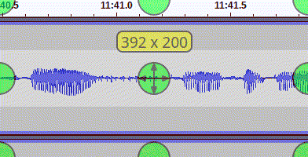

# Debreather plugin for Audacity
*Audacity plugin for reducing volume of selection using the envelope tool*

[Audacity](https://www.audacityteam.org/) is a free, open source audio editor. This plugin allows for the quick reduction of the volume of the selected audio using the envelope tool. The advantage of using the envelope tool is that this operation is non-destructive.

It can be useful to reduce the volume of breathing noises e.g. in podcast recordings without completely erasing these breaks.

Manual volume adjustment:

Using the plugin with keyboard shortcut:

## Installation

- Download the file *Debreather.ny*
- Open Audacity
- Select [Tools]->[Nyquist Plug-in Installer...]
- In the dialog, select the *Debreather.ny* file and press "OK"
- Select [Tools]->[Add/Remove Plug-ins] (or [Tools]->[Plugin Manager] in newer Audacity versions)
- Search for the plugin with the name "Debreather" and press "Enable" (You might have to press the "Rescan" first in order to detect the plugin)
- Now "Debreather" should appear in the "Tools" menu
- In order to assign a keyboard shortcut to the plugin, click [Edit]->[Preferences]
- Select the category "Keyboard" (or "Shortcuts" in newer Audacity versions)
- In the search field enter "Debreather", the list below should be filtered now
- Assign a keyboard shortcut to the debreather (e.g. ALT+D)

You should now be able to reduce the volume of the current selection via keyboard shortcut.

## Acknowledgements
- I implemented this plugin using the code, the user *steve* provided in the audacity forums: https://forum.audacityteam.org/viewtopic.php?t=107806
